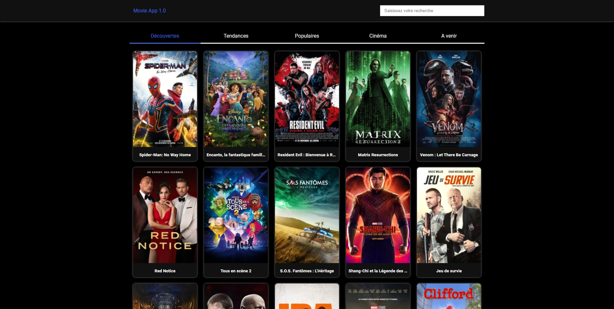
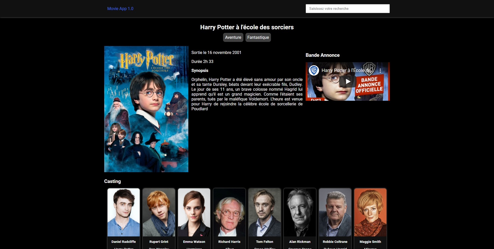
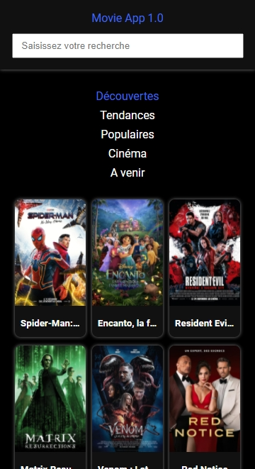
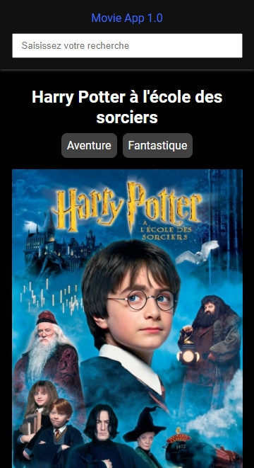

# Projet en Reactjs avec Scss et l'Api TheMovieDB

This project was bootstrapped with [Create React App](https://github.com/facebook/create-react-app) & [The Movie Database (TMDB) API](https://developers.themoviedb.org/3/getting-started/introduction).

## Dependancy

- node-sass
- react-router-dom

## Author

- Website - [thicode.fr/](https://thicode.fr/)
- Frontend Mentor - [@ThiCode126](https://www.frontendmentor.io/profile/ThiCode126)
- Twitter - [@code_thi](https://twitter.com/code_thi)
